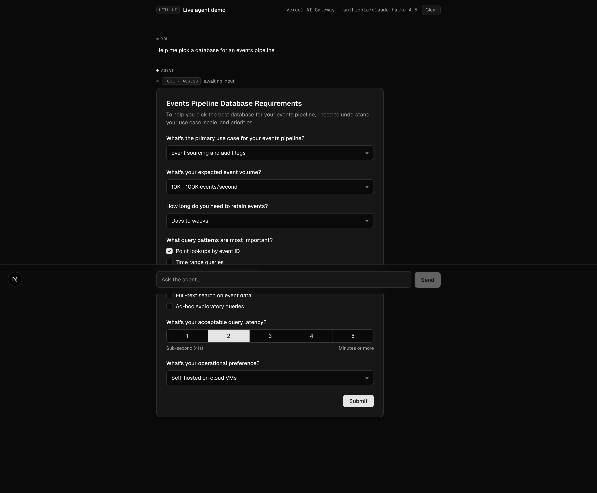
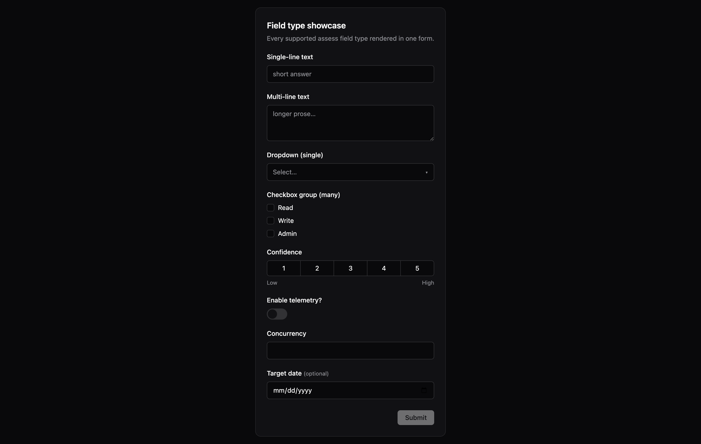
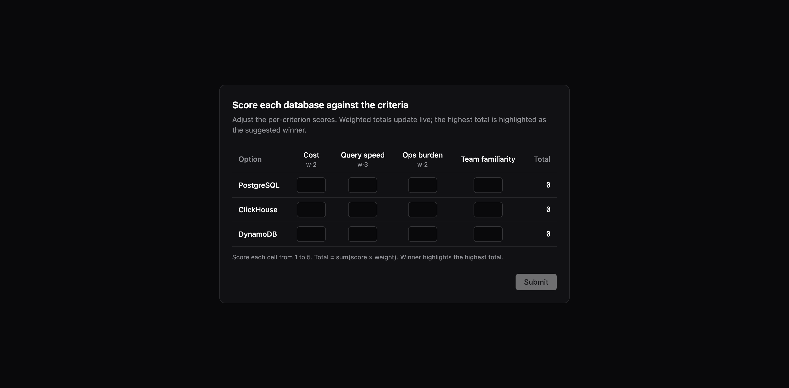

# hitl-ui

> Human-in-the-loop UI components for AI agents.

When an LLM agent needs structured input from a human mid-workflow, developers either build bespoke UI every time or fall back to "please type your answer." Neither scales. **hitl-ui** ships each component as a **triad**:

1. A React component (you own the source after install)
2. A JSON tool definition the agent invokes
3. An opinionated agent-instruction file that teaches your model *when* and *how* to use it

The instructions are the differentiator. Form components are easy to find. Opinionated, tested guidance for agent-driven UX is not.



*Screenshot from `examples/vercel-ai-sdk` — a real Anthropic Claude agent running through Vercel AI Gateway, calling the `assess` tool with an events-pipeline requirements form. The user fills it in; the answers go back to the agent as the tool result; the conversation continues.*

## Quick start

```bash
# In your existing Next.js / React app
npx @kdowswell/hitl-ui@latest init
npx @kdowswell/hitl-ui@latest add assess
npx @kdowswell/hitl-ui@latest add decide
```

This drops each triad into your project:

```
components/hitl-ui/<name>/<name>.tsx       ← React component, you own the source
tools/hitl-ui/<name>.tool.json             ← JSON Schema for the agent
instructions/hitl-ui/<name>.instructions.md ← Opinionated guidance prose
```

Wire the components into your chat framework's tool-call renderer and the JSON tool definitions into your agent. See [`examples/vercel-ai-sdk`](./examples/vercel-ai-sdk) for a complete integration with Vercel AI SDK v6, or [`examples/nextjs-tool-call`](./examples/nextjs-tool-call) for a static no-LLM-required demo.

## Theming

Components use a CSS-variable token cascade. If your app already declares the standard shadcn-style tokens (`--card`, `--foreground`, `--primary`, `--border`, `--ring`, `--radius`, etc.), components inherit them automatically. If not, sensible defaults render in both light and dark mode (via `prefers-color-scheme`). Override any single token at any DOM scope to retheme without touching component source.

## Component catalog

The catalog is organized by the **cognitive operation** the human is performing — a framing borrowed from HITL research literature ([Magentic-UI, MS Research 2025](https://www.microsoft.com/en-us/research/wp-content/uploads/2025/07/magentic-ui-report.pdf); [HITL systematic review, MDPI 2026](https://www.mdpi.com/1099-4300/28/4/377)).

### Shipped

#### `assess` — provide info

A multi-question structured form. 1–8 questions, ten heterogeneous field types (text, textarea, select, multi_select, scale, boolean, number, email, url, date), per-field validation, typed result keyed by question id. Use it when you need structured answers before proceeding.



```bash
npx @kdowswell/hitl-ui@latest add assess
```

[Schema & full instructions ↗](./packages/components/assess/) · [Storybook variants ↗](./packages/components/assess/assess.stories.tsx)

---

#### `decide` — pick + weigh options

A decision UI in two modes. **`select`** mode renders option cards for a simple pick. **`score`** mode renders a matrix grid where the human scores each option against weighted criteria; the highest weighted total is highlighted as the suggested winner in real time. 2–5 options, up to 6 criteria. Use it when the human needs to weigh tradeoffs.



```bash
npx @kdowswell/hitl-ui@latest add decide
```

[Schema & full instructions ↗](./packages/components/decide/) · [Storybook variants ↗](./packages/components/decide/decide.stories.tsx)

### Planned

| Component | Cognitive op | Description |
|---|---|---|
| `rank` | Order | Drag-and-drop priority sequencing |
| `approve` | Gate | Yes/no on a proposed action with optional rationale |
| `annotate` | Annotate | Edit / mark up content the agent produced |
| `disambiguate` | Disambiguate | Single-pick from ambiguous referents (lighter than `decide`) |
| `calibrate` | Calibrate | Pairwise comparisons or example ratings to anchor the agent |

See [`hitl-ui-spec.md`](./hitl-ui-spec.md) for full schemas and the cognitive-op rationale for each pattern.

## Repo layout

This is a Turborepo monorepo:

- `packages/cli` — the published `@kdowswell/hitl-ui` package (Commander-based CLI + `defineConfig` runtime).
- `packages/components` — source of truth for component triads. Not published. Component playground at `pnpm storybook` (http://localhost:6006).
- `examples/nextjs-tool-call` — Next.js 16 + React 19 + Tailwind v4 demo with **static** mock tool-call payloads (no LLM required).
- `examples/vercel-ai-sdk` — Same stack, **live agent loop** powered by Vercel AI SDK v6. Default provider is the **Vercel AI Gateway** (one key, any model — Claude 4.5/4.6/4.7, GPT-5, Gemini 2.5, etc.); auto-falls back to OpenAI direct or local Ollama. See its [README](./examples/vercel-ai-sdk/README.md) for setup.

See [`hitl-ui-spec.md`](./hitl-ui-spec.md) for the authoritative architecture spec, including per-component schemas, rendering models, and the positioning vs Adaptive Cards / Google A2UI / CopilotKit. The original draft (5 components, "agent-ui" name) lives at [`agent-ui-spec.md`](./agent-ui-spec.md) for historical context. See [`CLAUDE.md`](./CLAUDE.md) for contributor guidance.

## Development

```bash
pnpm install
pnpm build       # builds the CLI + registry
pnpm test        # 33 tests across CLI integration + component units
pnpm storybook   # component playground at http://localhost:6006
```

## License

MIT © 2026 Kurt Dowswell
